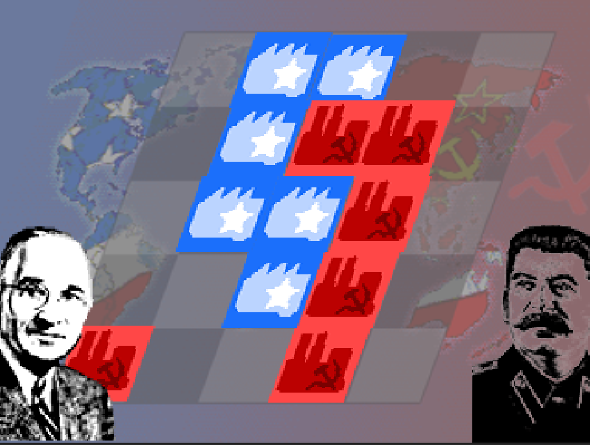

# Capitalists vs Communists

[Game jam](https://ldjam.com/events/ludum-dare/43/$129381) for Ludum Dare, Nov 30 - Dec 2, 2018.

Pixel-art 8-bit sound remake of the classic Chinese Game of Go on a 5x5 grid.

## How to play

1. Build a base in an empty place.
1. Pass the computer to the other player.
1. To score, surround the biggest territory.
1. To destroy, surround the enemy base.
1. More detailed [rules of Go.](https://senseis.xmp.net/?BasicRulesOfGo)

## Credits

- Art: Toby Hefflin
- Music: Cole Masaitis
- Sound Effects: Jason Denney
- Engineering: Ethan Kennerly
- Host: GluPlay, creator of Cooking Dash

### Tools

- Unity 2017.4.10f1
- [GoSharp](https://github.com/paviad/GoSharp) by Aviad Pineles

[Engineering notes](engineering.md)
