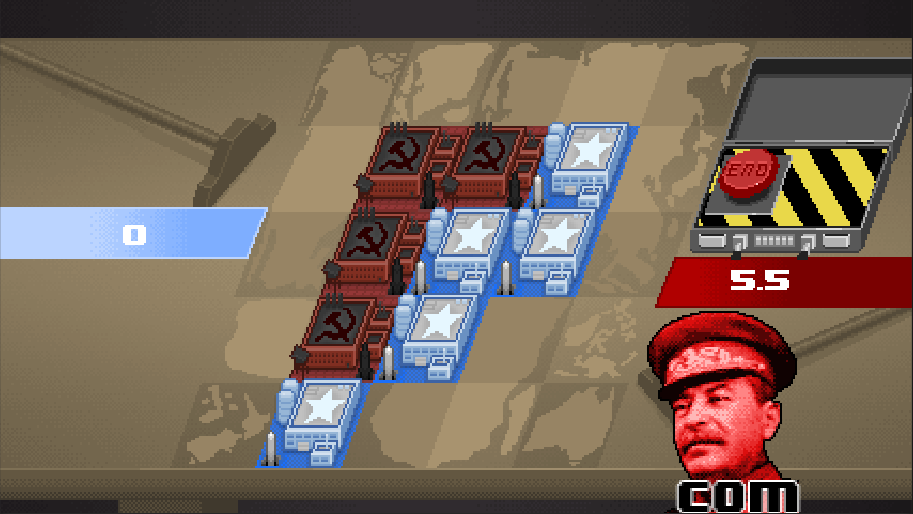

- Play [Web GL](http://finegamedesign.com/cappiesvscommies/webgl/index.html)
- Play [Android](http://finegamedesign.com/cappiesvscommies/cappiesvscommies.apk)
- [Comment](https://ldjam.com/events/ludum-dare/43/cappies-vs-commies) on Ludum Dare (Nov 30 - Dec 2, 2018).

# Cappies vs Commies

Pixel-art 8-bit sound remake of the classic Chinese Game of Go on a 5x5 grid.

## How to play

1. Build a base in an empty place.
1. Pass the computer to the other player.
1. To score, surround the biggest territory.
1. To destroy, surround the enemy base.
1. More detailed [rules of Go.](https://senseis.xmp.net/?BasicRulesOfGo)
1. There is no AI to the scoring, so if you want the score to be accurate, capture all the dead pieces before ending.

## Credits

- Art: Toby Hefflin
- Music: Cole Masaitis
- Sound Effects: Jason Denney
- Engineering: Ethan Kennerly
- Host: GluPlay, creator of Cooking Dash
- Playtesters:
[Jerome Byrne](playtesters.md#jerome-byrne),
[Shine Garg](playtesters.md#shine-garg)

### Tools

- Unity 2017.4.10f1
- Text Mesh Pro
- [GoSharp](https://github.com/paviad/GoSharp) by Aviad Pineles

[Engineering notes](engineering.md)
